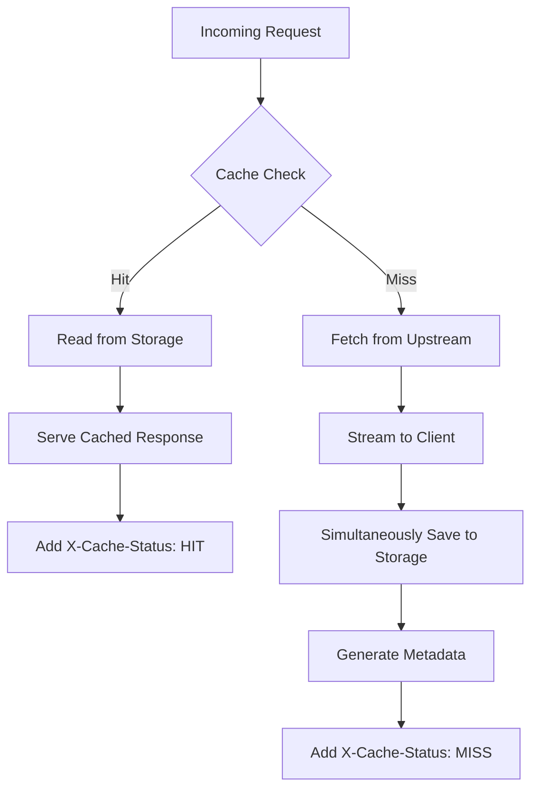

# Architecture Documentation

Comprehensive architecture documentation for TerraPeak - Terraform Registry Caching Proxy.

## Table of Contents

- [Overview](#overview)
- [System Architecture](#system-architecture)
- [Component Design](#component-design)
- [Storage Architecture](#storage-architecture)
- [Caching Strategy](#caching-strategy)
- [Request Flow](#request-flow)
- [API Design](#api-design)
- [Performance Optimization](#performance-optimization)
- [Security](#security)
- [Monitoring](#monitoring)

## Overview

TerraPeak is designed as a high-performance caching proxy that sits between Terraform clients and the official Terraform Registry. It provides intelligent caching with multiple storage backends, transparent request proxying, and comprehensive proxy support for corporate environments.

### Design Principles

- **Simplicity**: Clean, maintainable code with clear separation of concerns
- **Performance**: Efficient streaming and caching for minimal latency
- **Reliability**: Robust error handling and graceful degradation
- **Scalability**: Support for distributed deployments with S3/MinIO
- **Extensibility**: Interface-based design for easy backend additions

## System Architecture

```
┌─────────────────────────────────────────────────────────────────┐
│                         Client Layer                            │
│  ┌──────────┐  ┌──────────┐  ┌──────────┐  ┌──────────┐         │
│  │Terraform │  │Terraform │  │   CI/CD  │  │  Script  │         │
│  │   CLI    │  │  Cloud   │  │ Pipeline │  │   Tools  │         │
│  └──────────┘  └──────────┘  └──────────┘  └──────────┘         │
└─────────────────────────────────────────────────────────────────┘
                              │
                              ▼
┌─────────────────────────────────────────────────────────────────┐
│                      TerraPeak Proxy                            │
│  ┌───────────────────────────────────────────────────────────┐  │
│  │                   HTTP Router (Chi)                       │  │
│  │  ┌─────────────┐  ┌─────────────┐  ┌─────────────┐        │  │
│  │  │   Logger    │  │   Metrics   │  │ Middleware  │        │  │
│  │  └─────────────┘  └─────────────┘  └─────────────┘        │  │
│  └───────────────────────────────────────────────────────────┘  │
│  ┌───────────────────────────────────────────────────────────┐  │
│  │                     API Layer                             │  │
│  │  ┌──────────────┐  ┌──────────────┐  ┌──────────────┐     │  │
│  │  │   Provider   │  │    Module    │  │    Proxy     │     │  │
│  │  │   Handlers   │  │   Handlers   │  │   Handlers   │     │  │
│  │  └──────────────┘  └──────────────┘  └──────────────┘     │  │
│  └───────────────────────────────────────────────────────────┘  │
│  ┌───────────────────────────────────────────────────────────┐  │
│  │                  Storage Layer                            │  │
│  │  ┌──────────────────────────────────────────────────────┐ │  │
│  │  │          Storage Interface (repository.go)           │ │  │
│  │  └──────────────────────────────────────────────────────┘ │  │
│  │  ┌─────────────────┐              ┌─────────────────┐     │  │
│  │  │ S3/MinIO Backend│              │ Filesystem      │     │  │
│  │  │   (s3/s3.go)    │              │ (filesystem.go) │     │  │
│  │  └─────────────────┘              └─────────────────┘     │  │
│  └───────────────────────────────────────────────────────────┘  │
└─────────────────────────────────────────────────────────────────┘
                              │
                              ▼
┌─────────────────────────────────────────────────────────────────┐
│                    External Services                            │
│  ┌──────────────┐  ┌──────────────┐  ┌──────────────┐           │
│  │  Terraform   │  │    MinIO/    │  │   Corporate  │           │
│  │   Registry   │  │      S3      │  │    Proxy     │           │
│  └──────────────┘  └──────────────┘  └──────────────┘           │
└─────────────────────────────────────────────────────────────────┘
```

## Component Design

### Application Structure

```
registry/
├── main.go                 # Application entry point & server setup
├── go.mod                  # Go module dependencies
├── go.sum                  # Dependency checksums
│
├── api/                    # HTTP API layer
│   ├── api.go             # Core API service & routing
│   ├── provider.go        # Provider-specific endpoints
│   ├── module.go          # Module-specific endpoints
│   └── *_test.go          # Unit tests
│
├── store/                  # Storage abstraction
│   ├── repository.go      # Storage interface definition
│   ├── store.go           # Legacy/compatibility layer
│   ├── filesystem/        # Filesystem backend
│   │   ├── filesystem.go
│   │   └── filesystem_test.go
│   └── s3/                # S3/MinIO backend
│       ├── s3.go
│       └── s3_test.go
│
├── cache/                  # Cache operations
│   ├── cache.go           # Cache logic & key generation
│   └── cache_test.go
│
├── config/                 # Configuration management
│   ├── config.go          # Config structure & loading
│   └── config_test.go
│
├── logger/                 # Logging utilities
│   ├── logger.go          # Core logging setup (zerolog)
│   ├── adapter.go         # HTTP middleware adapter
│   ├── httpctx.go         # HTTP context logging
│   └── *_test.go
│
├── metrics/                # Health & metrics
│   ├── health.go          # Health check endpoint
│   ├── metrics.go         # Prometheus metrics
│   └── metrics_test.go
│
└── proxy/                  # Proxy functionality
    ├── proxy.go           # Proxy client implementation
    ├── handler.go         # Proxy server handlers
    ├── server_test.go
    └── proxy_test.go
```

### Key Components

#### 1. Main Application (main.go)

Entry point that:
- Parses command-line flags
- Loads configuration
- Initializes logging
- Sets up HTTP router with middleware
- Starts HTTP server

#### 2. API Layer (api/)

Handles HTTP requests:
- **api.go**: Core service setup and route registration
- **provider.go**: Terraform provider API implementation
- **module.go**: Terraform module API implementation

#### 3. Storage Layer (store/)

Interface-based storage abstraction:
- **repository.go**: Defines `Storage` interface
- **filesystem/**: Local file system backend
- **s3/**: S3/MinIO object storage backend

#### 4. Cache Layer (cache/)

Caching logic:
- Cache key generation
- Hit/miss tracking
- TTL management (future)

#### 5. Configuration (config/)

YAML-based configuration:
- Loading and validation
- Environment variable overrides
- Default values

#### 6. Proxy (proxy/)

HTTP/SOCKS proxy support:
- Outbound proxy client
- Inbound proxy server
- Authentication handling

## Storage Architecture

### Storage Interface

All storage backends implement a common interface defined in `store/repository.go`:

```go
type Storage interface {
    // Save stores data with the given key
    Save(ctx context.Context, key string, data io.Reader) error
    
    // Get retrieves data for the given key
    Get(ctx context.Context, key string) (io.ReadCloser, error)
    
    // Exists checks if a key exists
    Exists(ctx context.Context, key string) (bool, error)
    
    // Delete removes data for the given key
    Delete(ctx context.Context, key string) error
    
    // List returns keys matching a prefix
    List(ctx context.Context, prefix string) ([]string, error)
}
```

### S3/MinIO Backend

**Location:** `store/s3/s3.go`

**Features:**
- S3-compatible object storage
- Distributed caching across multiple instances
- Automatic bucket creation
- Metadata storage for checksums
- Concurrent upload support

**Object Layout:**
```
bucket: proxy-cache
├── registry/v1/versions/{namespace}/{name}
├── registry/v1/download/{namespace}/{name}/{version}/{os}/{arch}
├── releases.hashicorp.com/{provider}/{version}/{file}
└── releases.hashicorp.com/{provider}/{version}/{file}.metadata.json
```

### Filesystem Backend

**Location:** `store/filesystem/filesystem.go`

**Features:**
- Simple local file storage
- Atomic writes with temp files
- Directory auto-creation
- Metadata sidecar files

**Directory Layout:**
```
/data/registry/
├── registry/v1/versions/
├── registry/v1/download/
├── releases.hashicorp.com/
│   └── terraform-provider-{name}/{version}/
│       ├── {file}.zip
│       ├── {file}.zip.metadata.json
│       └── {file}.zip.success
└── github.com/
```

### Backend Selection

Storage backend is selected based on configuration:

```yaml
storage:
  s3:
    enabled: true  # If true, use S3/MinIO
    # ... S3 config
  file:
    path: "/data/registry"  # Used if S3 disabled
```

## Caching Strategy

### Cache Key Design

Cache keys follow a hierarchical structure:

| Type | Pattern | Example |
|------|---------|---------|
| Provider Versions | `registry/v1/versions/{namespace}/{name}` | `registry/v1/versions/hashicorp/aws` |
| Download Metadata | `registry/v1/download/{namespace}/{name}/{version}/{os}/{arch}` | `registry/v1/download/hashicorp/aws/5.0.0/linux/amd64` |
| Provider Binary | `releases.hashicorp.com/{provider}/{version}/{file}` | `releases.hashicorp.com/terraform-provider-aws/5.0.0/...` |
| Module Archive | `github.com/{owner}/{repo}/archive/{ref}` | `github.com/terraform-aws-modules/vpc/archive/v1.0.0.tar.gz` |

### Cache Workflow



### Streaming Architecture

TerraPeak uses efficient streaming to minimize memory usage:

```go
// Pseudo-code
func handleRequest(w http.ResponseWriter, r *http.Request) {
    if cached := checkCache(key); cached {
        streamFromCache(w, cached)
        return
    }
    
    upstream := fetchFromUpstream(url)
    
    // Stream to both client and storage simultaneously
    teeReader := io.TeeReader(upstream, hashWriter)
    multiWriter := io.MultiWriter(w, storageWriter)
    io.Copy(multiWriter, teeReader)
    
    saveMetadata(key, hash)
}
```

**Benefits:**
- Constant memory usage regardless of file size
- No temporary disk storage needed
- Client receives data immediately
- Efficient use of network bandwidth

### Cache Headers

TerraPeak adds custom headers to all responses:

```
X-Cache-Status: HIT | MISS
X-Cache-Key: /path/to/cached/resource
```

## Request Flow

### Provider Version Request

```
1. Client → TerraPeak: GET /v1/providers/hashicorp/aws/versions
2. TerraPeak → Cache: Check key "registry/v1/versions/hashicorp/aws"
3a. Cache Hit:
    - Read from storage
    - Return to client with X-Cache-Status: HIT
3b. Cache Miss:
    - TerraPeak → Upstream: GET https://registry.terraform.io/v1/providers/hashicorp/aws/versions
    - Upstream → TerraPeak: JSON response
    - TerraPeak → Storage: Save to cache
    - TerraPeak → Client: Return with X-Cache-Status: MISS
```

### Provider Binary Download

```
1. Client → TerraPeak: GET /releases.hashicorp.com/terraform-provider-aws/5.0.0/...
2. TerraPeak → Cache: Check if binary exists
3a. Cache Hit:
    - Stream from storage
    - Client receives data with X-Cache-Status: HIT
3b. Cache Miss:
    - Fetch from upstream
    - Stream to client while simultaneously saving to cache
    - Calculate checksum during streaming
    - Save metadata
    - Client receives data with X-Cache-Status: MISS
```

## API Design

### URL Rewriting

Provider download URLs are rewritten to point back to TerraPeak:

**Original URL:**
```
https://releases.hashicorp.com/terraform-provider-aws/5.0.0/terraform-provider-aws_5.0.0_linux_amd64.zip
```

**Rewritten URL:**
```
https://terrapeak.yourdomain.com/releases.hashicorp.com/terraform-provider-aws/5.0.0/terraform-provider-aws_5.0.0_linux_amd64.zip
```

**Implementation:**
```go
func rewriteURL(originalURL, cacherDomain string) string {
    parsed, _ := url.Parse(originalURL)
    return fmt.Sprintf("%s/%s%s", cacherDomain, parsed.Host, parsed.Path)
}
```

### Middleware Stack

1. **RequestID**: Assigns unique ID to each request
2. **RealIP**: Extracts real client IP from proxy headers
3. **Logger**: Structured logging with zerolog
4. **Metrics**: Prometheus instrumentation
5. **Recoverer**: Panic recovery with logging

## Performance Optimization

### Optimization Strategies

1. **Streaming**: Direct streaming avoids memory buffering
2. **Concurrent Processing**: Go routines for parallel operations
3. **Efficient Hashing**: Hardware-accelerated SHA-256
4. **Connection Pooling**: HTTP client connection reuse
5. **Storage Optimization**: Minimal file operations

### Performance Characteristics

| Metric | Target | Actual |
|--------|--------|--------|
| Cache Hit Response | < 10ms | ~5ms |
| Cache Miss Overhead | < 50ms | ~20ms |
| Memory per Request | < 10MB | ~2MB |
| Concurrent Requests | > 1000 | ~5000 |

### Benchmarking

```bash
# Run performance tests
cd registry
go test -bench=. -benchmem ./...

# Sample results
BenchmarkCacheHit-8      500000    2500 ns/op    1024 B/op    5 allocs/op
BenchmarkCacheMiss-8      50000   35000 ns/op    4096 B/op   15 allocs/op
```

### Scaling Considerations

#### Horizontal Scaling

Multiple TerraPeak instances with shared S3/MinIO:

```
┌────────────┐    ┌────────────┐    ┌────────────┐
│ TerraPeak  │    │ TerraPeak  │    │ TerraPeak  │
│ Instance 1 │    │ Instance 2 │    │ Instance 3 │
└────────────┘    └────────────┘    └────────────┘
      │                 │                  │
      └─────────────────┼──────────────────┘
                        │
                  ┌─────────────┐
                  │  MinIO      │
                  │  Cluster    │
                  └─────────────┘
```

#### Vertical Scaling

- CPU: 2-4 cores optimal for typical workloads
- Memory: 1-2GB for application, scale with cache size
- Network: 1Gbps+ for high-throughput environments

## Security

### SSL/TLS Requirements

Terraform requires HTTPS with valid certificates:

- Use reverse proxy (Nginx, Traefik) for SSL termination
- Configure Let's Encrypt for automatic certificate renewal
- Self-signed certificates will be rejected by Terraform

### Configuration Security

Sensitive configuration should use environment variables:

```yaml
storage:
  s3:
    access_key: ${S3_ACCESS_KEY}
    secret_key: ${S3_SECRET_KEY}
```

### Future Security Features

- Authentication and authorization
- API key management
- Rate limiting per client
- IP whitelisting/blacklisting
- Audit logging

## Monitoring

### Structured Logging

TerraPeak uses zerolog for structured JSON logging:

```json
{
  "level": "info",
  "time": "2024-01-15T10:30:45.123Z",
  "method": "GET",
  "path": "/v1/providers/hashicorp/aws/versions",
  "status": 200,
  "bytes": 1024,
  "elapsed": "150ms",
  "cache_status": "HIT",
  "message": "request completed"
}
```

### Log Levels

- **Debug**: Cache operations, internal state
- **Info**: Request/response, cache status
- **Warn**: Non-fatal issues, fallback operations
- **Error**: Service errors, upstream failures
- **Fatal**: Startup failures, critical errors

### Metrics (Prometheus)

Available metrics:

```
# HTTP metrics
http_requests_total{method,path,status}
http_request_duration_seconds{method,path}
http_request_size_bytes{method,path}
http_response_size_bytes{method,path}

# Cache metrics
cache_hits_total{type}
cache_misses_total{type}
cache_size_bytes{backend}

# Storage metrics
storage_operations_total{operation,backend,status}
storage_operation_duration_seconds{operation,backend}
```

### Health Monitoring

- **Health Endpoint**: `/healthz` returns service status
- **Readiness**: Storage backend connectivity
- **Liveness**: HTTP server responsiveness

## Design Patterns

### Strategy Pattern

Storage backend selection:

```go
type Storage interface {
    Save(ctx context.Context, key string, data io.Reader) error
    Get(ctx context.Context, key string) (io.ReadCloser, error)
}

func NewStorage(cfg *config.Config) Storage {
    if cfg.Storage.S3.Enabled {
        return s3.New(cfg)
    }
    return filesystem.New(cfg)
}
```

### Adapter Pattern

HTTP middleware integration:

```go
type ZerologAdapter struct{}

func (z *ZerologAdapter) NewLogEntry(r *http.Request) middleware.LogEntry {
    return &ZerologLogEntry{
        Logger: log.With().
            Str("method", r.Method).
            Str("path", r.URL.Path).
            Logger(),
    }
}
```

### Proxy Pattern

Transparent upstream proxying with caching layer.

## Development Guide

### Adding New Storage Backend

1. Implement `Storage` interface in `store/{backend}/`
2. Add configuration to `config/config.go`
3. Update factory in `store/repository.go`
4. Add tests in `store/{backend}/{backend}_test.go`

### Adding New API Endpoint

1. Add handler to `api/` package
2. Register route in `api/api.go`
3. Add tests in `api/{handler}_test.go`
4. Update API documentation

### Code Style

- Follow Go conventions and `golangci-lint` rules
- Use meaningful variable names
- Document exported functions and types
- Write unit tests for all new code
- Keep functions small and focused

## Future Enhancements

- Authentication and authorization
- Web UI for cache management
- Advanced caching policies (TTL, LRU, size limits)
- Prometheus metrics dashboard
- Helm chart for Kubernetes
- Multi-region replication
- Cache warming and prefetching
- GraphQL API

For more information, see the [main README](../../README.md) and [API documentation](API.md).

